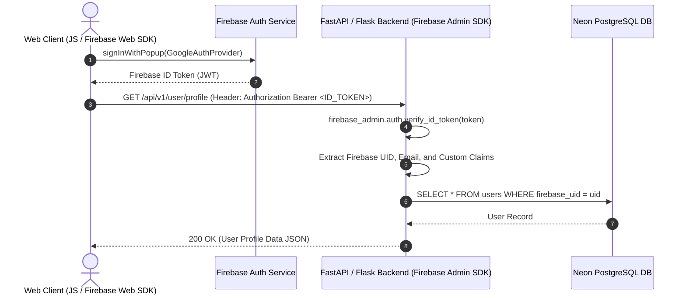

# Authentication Strategy & Libraries (Authentication.md)

## 1. Executive Overview
This document specifies the authentication architecture, security protocols, and library ecosystem for tech applications. The primary identity provider is **Firebase Authentication** coupled with Firebase Admin SDK for Python backends (FastAPI / Flask) and Firebase Web SDK for frontend interfaces.

---

## 2. Authentication Libraries Matrix

### 2.1 Backend Libraries (Python Framework)
| Library | Version / Spec | Purpose & Primary Role |
| :--- | :--- | :--- |
| `firebase-admin` | `^6.2.0` | Official Firebase Admin SDK to verify ID tokens, manage users, and set custom claims |
| `PyJWT` / `python-jose[cryptography]` | `^2.8.0` | Fallback JWT encoding/decoding, RS256 signature verification, key rotation |
| `passlib[argon2,bcrypt]` | `^1.7.4` | Password hashing algorithms for hybrid or legacy authentication paths |
| `cryptography` | `^41.0.0` | Low-level cryptographic primitives for token signatures and certificate management |
| `slowapi` | `^0.1.9` | Rate limiting for authentication endpoints to prevent brute-force attacks |

### 2.2 Frontend Libraries (Web Client)
| Library | Version / Spec | Purpose & Primary Role |
| :--- | :--- | :--- |
| `firebase/app` | `^10.8.0` | Core Firebase app initialization module |
| `firebase/auth` | `^10.8.0` | Modular Firebase Authentication (Google, Email/Password, OAuth, Anonymous) |
| `firebase/messaging` | `^10.8.0` | Firebase Cloud Messaging (FCM) for push notifications and device tokens |

---

## 3. Firebase Authentication Architecture



---

## 4. Implementation Specifications & Code Templates

### 4.1 Backend Token Verification Middleware (FastAPI + Python)

```python
import firebase_admin
from firebase_admin import auth, credentials
from fastapi import Depends, HTTPException, status
from fastapi.security import HTTPBearer, HTTPAuthorizationCredentials

# Initialize Firebase Admin SDK
cred = credentials.Certificate("path/to/firebase-service-account.json")
firebase_admin.initialize_app(cred)

security = HTTPBearer()

async def get_current_firebase_user(
    credentials: HTTPAuthorizationCredentials = Depends(security)
) -> dict:
    token = credentials.credentials
    try:
        # Verify Firebase ID Token
        decoded_token = auth.verify_id_token(token, check_revoked=True)
        return {
            "uid": decoded_token["uid"],
            "email": decoded_token.get("email"),
            "role": decoded_token.get("role", "user"),
            "claims": decoded_token
        }
    except auth.RevokedIdTokenError:
        raise HTTPException(
            status_code=status.HTTP_401_UNAUTHORIZED,
            detail="Authentication token has been revoked."
        )
    except Exception as e:
        raise HTTPException(
            status_code=status.HTTP_401_UNAUTHORIZED,
            detail=f"Invalid authentication token: {str(e)}"
        )
```

### 4.2 Frontend Client Auth Initialization (JS Modular v10 SDK)

```javascript
import { initializeApp } from "https://www.gstatic.com/firebasejs/10.8.0/firebase-app.js";
import { 
    getAuth, 
    signInWithEmailAndPassword, 
    GoogleAuthProvider, 
    signInWithPopup, 
    onAuthStateChanged 
} from "https://www.gstatic.com/firebasejs/10.8.0/firebase-auth.js";

const firebaseConfig = {
    apiKey: "YOUR_API_KEY",
    authDomain: "YOUR_PROJECT_ID.firebaseapp.com",
    projectId: "YOUR_PROJECT_ID",
    storageBucket: "YOUR_PROJECT_ID.appspot.com",
    messagingSenderId: "YOUR_SENDER_ID",
    appId: "YOUR_APP_ID"
};

const app = initializeApp(firebaseConfig);
const authService = getAuth(app);

// Get current bearer token for API requests
export async function getBearerToken() {
    const user = authService.currentUser;
    if (!user) throw new Error("No authenticated user.");
    return await user.getIdToken(/* forceRefresh */ false);
}

// Google Sign-In Provider
export async function loginWithGoogle() {
    const provider = new GoogleAuthProvider();
    const result = await signInWithPopup(authService, provider);
    return result.user;
}
```

---

## 5. Security & Token Lifecycle Protocol

1. **Token Lifetime**: Firebase ID Tokens expire after 1 hour. Frontend clients automatically manage token refreshes via `getIdToken()`.
2. **Revocation Check**: The backend verifies token revocation status (`check_revoked=True`) for high-security endpoints.
3. **Custom Claims for RBAC**:
   - Admin roles are assigned on the server using `auth.set_custom_user_claims(uid, {'role': 'admin'})`.
   - Custom claims are encoded directly into the JWT payload, eliminating extra DB queries for permission checks.
4. **Environment Variables**:
   - `FIREBASE_CREDENTIALS_JSON`: Base64 encoded or path to service account key file.
   - Never commit `service-account.json` or raw private keys to Git.
