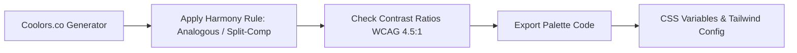

# Color Theory & Palette Strategy (Color_theory.md)

## 1. Executive Summary
This document defines the color theory principles, palette generation workflows, and UI theme specifications for tech applications. Color selection and contrast harmonization are driven using **Coolors.co** to ensure visual hierarchy, emotional resonance, and WCAG AA/AAA accessibility compliance.

---

## 2. Coolors.co Palette Generation Workflow



### 2.1 Coolors Workflow Steps
1. **Palette Discovery & Generation**: Generate or lock core brand colors on [Coolors.co](https://coolors.co).
2. **Color Harmony Selection**:
   - **Complementary**: High-contrast call-to-action buttons against dark surfaces.
   - **Analogous**: Smooth gradients and natural background/card transitions.
   - **Split-Complementary**: Rich accent highlights without visual friction.
3. **Palette Export Formats**:
   - Export as **Tailwind CSS** color objects.
   - Export as **CSS Custom Properties** (`:root` variables).
   - Export as **HEX / HSL / RGB** palette arrays.

---

## 3. The 60-30-10 Rule & Semantic Color Matrix

To maintain visual balance, colors are distributed according to the **60-30-10 Rule**:
- **60% Dominant (Canvas & Backgrounds)**: Neutral dark or crisp light tones.
- **30% Secondary (Surfaces & Structural UI)**: Cards, sidebars, navigation bars, borders.
- **10% Accent (Call-to-Action & Interactive States)**: Primary buttons, active tabs, highlights.

### 3.1 Dark Mode Palette Matrix (Generated via Coolors)

| Role | Color Name | Hex Code | HSL Value | Usage |
| :--- | :--- | :--- | :--- | :--- |
| **Canvas (60%)** | Slate Midnight | `#0F172A` | `hsl(222, 47%, 11%)` | Main app backdrop |
| **Surface (30%)** | Deep Navy | `#1E293B` | `hsl(217, 33%, 17%)` | Cards, modals, containers |
| **Border (Structural)** | Slate Line | `#334155` | `hsl(215, 25%, 27%)` | Input borders, dividers |
| **Primary Accent (10%)**| Electric Indigo | `#6366F1` | `hsl(239, 84%, 67%)` | Buttons, active links, CTAs |
| **Primary Hover** | Bright Violet | `#4F46E5` | `hsl(243, 75%, 59%)` | Button hover/active states |
| **Text Primary** | Crisp White | `#F8FAFC` | `hsl(210, 40%, 98%)` | Primary headings & copy |
| **Text Muted** | Slate Gray | `#94A3B8` | `hsl(215, 20%, 65%)` | Subtitles, disabled states |
| **Success Alert** | Emerald Mint | `#10B981` | `hsl(160, 84%, 39%)` | Confirmation, positive feedback |
| **Warning Alert** | Amber Gold | `#F59E0B` | `hsl(38, 92%, 50%)` | Caution toasts, warnings |
| **Error Alert** | Rose Coral | `#F43F5E` | `hsl(351, 89%, 60%)` | Error banners, validation failures |

---

## 4. Tailwind CSS Integration Code Template

Exported palette tokens integrated directly into `tailwind.config.js`:

```javascript
/** @type {import('tailwindcss').Config} */
module.exports = {
  darkMode: 'class',
  theme: {
    extend: {
      colors: {
        // Coolors Palette Mapping
        brand: {
          canvas: '#0F172A',
          surface: '#1E293B',
          border: '#334155',
          primary: '#6366F1',
          'primary-hover': '#4F46E5',
          'text-main': '#F8FAFC',
          'text-muted': '#94A3B8',
          success: '#10B981',
          warning: '#F59E0B',
          error: '#F43F5E',
        }
      }
    }
  }
}
```

---

## 5. Accessibility & Contrast Verification (WCAG Standards)

Every color combination must be audited using [Coolors Contrast Checker](https://coolors.co/contrast-checker):
- **Normal Text (under 18pt)**: Minimum contrast ratio of **4.5:1** (WCAG AA).
- **Large Text (18pt+ or 14pt bold)**: Minimum contrast ratio of **3.0:1** (WCAG AA).
- **Interactive Focus States**: Focus rings must possess a minimum contrast ratio of **3.0:1** against adjacent background colors.
