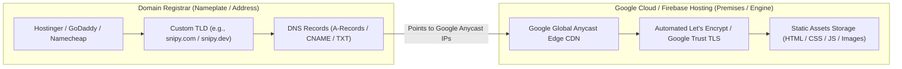
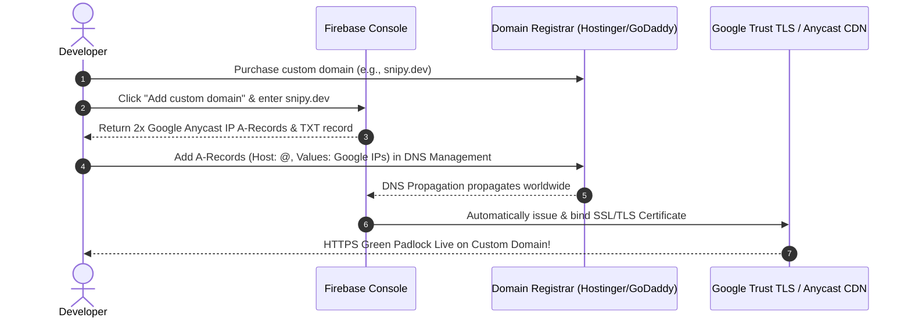
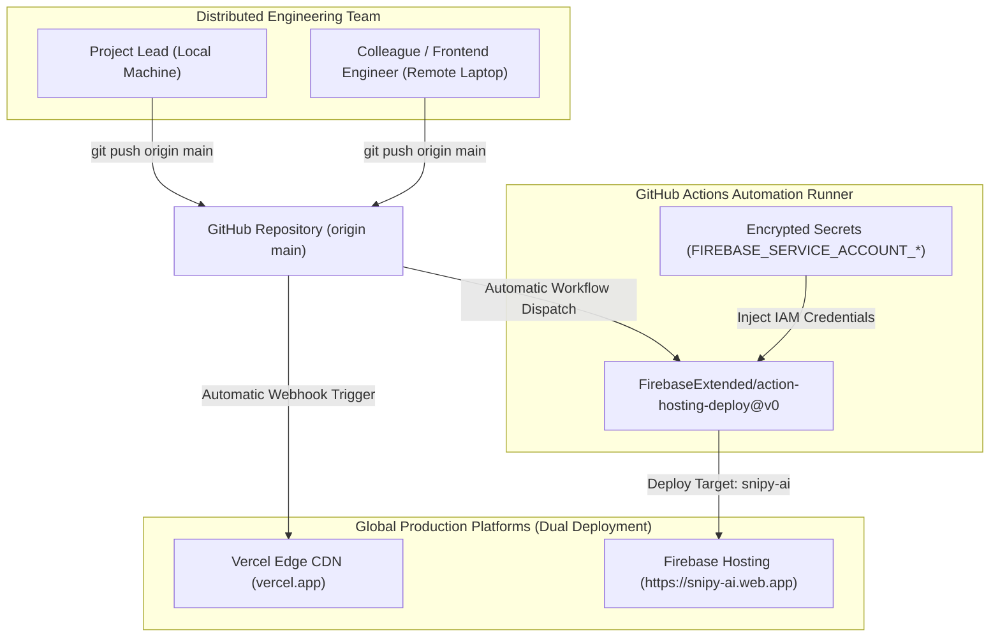

# Frontend Firebase Hosting & Domain Strategy (Deployment_firebase_domains.md)

## 1. Executive Summary
This document specifies the deployment architecture, domain provisioning strategy, and configuration runbook for hosting static web applications, single-page applications (SPAs), and extensions on **Google Firebase Hosting**. 

By leveraging Google's global SSD Edge Content Delivery Network (CDN), automated SSL/TLS termination, and multi-site virtual hosting, developers achieve sub-second page loads, zero-cost production hosting, and clean branded domain routing without financial exposure to runaway cloud bills.

---

## 2. Core Concepts: Hosting vs. Domain Registrar

To prevent architectural confusion, domain acquisition and asset hosting are strictly decoupled:



* **Domain Registrar (The "Nameplate"):** Sells top-level domain names (`.com`, `.dev`, `.ai`, `.in`, `.app`). Registrars do not store web code; they simply resolve names to IP addresses via DNS.
* **Firebase Hosting (The "Property"):** Serves HTML, CSS, JavaScript, and static media files across Google’s high-speed global edge points of presence (PoPs). Provides free automated SSL certificates and handles caching.

---

## 3. Firebase Hosting Spark Plan (Free Tier) Economics & Quotas

Firebase provides an enterprise-grade free tier (**Spark Plan**) that eliminates unexpected cloud billing surprises:

| Metric | Spark Plan Quota | Typical Web Application Usage | Safety Margin |
| :--- | :--- | :--- | :--- |
| **Pricing** | **$0 / month (Lifetime Free)** | $0.00 | 100% Free |
| **Credit Card Requirement** | **Not Required** | None | Zero financial risk |
| **Static Storage** | **10 GB** | ~3 MB – 5 MB (Frontend bundle) | Uses **< 0.05%** of quota |
| **Data Transfer / Bandwidth** | **10 GB / month (~360 MB / day)** | ~250 KB – 400 KB per visitor load | Accommodates **1,200 – 2,000 visitors/day** |
| **Custom Domains** | **Unlimited** with Free SSL/TLS | Connect custom domains or subdomains | Automated TLS certificate provisioning |
| **Multiple Sites** | **Up to 36 sites per project** | Multi-site isolation per environment | Dedicated clean subdomains |

### 🛡️ Cost-Safety Guardrail (Zero Runaway Bill Guarantee)
Unlike cloud compute APIs (e.g., AWS Bedrock token invocations) where unexpected traffic leads to direct credit card debits, **Firebase Spark Plan cannot bill the user**:
* If monthly bandwidth exceeds 10 GB, Firebase automatically pauses delivery and returns HTTP `503 Service Unavailable` until the quota reset interval.
* The account is never converted to a paid state unless the developer explicitly transitions to the Blaze (Pay-as-you-go) billing plan.

---

## 4. Multi-Site Architecture & Clean Domain Resolution

### 4.1 The Random Hash Collision Problem
When creating a Firebase project, the system assigns a globally unique Project ID. If the desired project name (e.g., `sniply`) is already claimed worldwide, Firebase appends an alphanumeric hash (e.g., `sniply-d4caf`). Consequently, the default hosting URLs inherit this hash:
* `https://sniply-d4caf.web.app` *(Unprofessional / cluttered)*
* `https://sniply-d4caf.firebaseapp.com`

### 4.2 The "Add Another Site" Multi-Site Solution
Firebase Hosting permits creating **multiple isolated sites** under a single project at zero cost:
1. Navigate to **Firebase Console** $\rightarrow$ **Hosting** $\rightarrow$ **Manage Site**.
2. Scroll to the bottom of the dashboard to locate **"Firebase hosting supports multiple sites"**.
3. Select **Add another site**.
4. Enter an uncluttered, brand-aligned Site ID (e.g., `snipy-ai`, `snipy-dev`, `snipy-code`).
5. Firebase immediately provisions high-prestige, clean subdomains:
   * **`https://snipy-ai.web.app`**
   * **`https://snipy-ai.firebaseapp.com`**

---

## 5. Configuration Architecture

### 5.1 Project Identifier Target (`.firebaserc`)
Defines the mapping between the local repository and the Firebase Project ID:

```json
{
  "projects": {
    "default": "sniply-d4caf"
  }
}
```

### 5.2 Hosting Routing & Security Headers (`firebase.json`)
Defines the target hosting site, public build folder, SPA URL rewrites, and security headers:

```json
{
  "hosting": {
    "site": "snipy-ai",
    "public": "frontend",
    "cleanUrls": true,
    "trailingSlash": false,
    "ignore": [
      "firebase.json",
      "**/.*",
      "**/node_modules/**"
    ],
    "headers": [
      {
        "source": "**",
        "headers": [
          {
            "key": "Access-Control-Allow-Origin",
            "value": "*"
          },
          {
            "key": "X-Content-Type-Options",
            "value": "nosniff"
          }
        ]
      }
    ]
  }
}
```

* **`"site": "snipy-ai"`**: Routes deployments directly to the clean target site instead of the hash-suffixed default.
* **`"cleanUrls": true`**: Automatically maps paths (e.g. `/dashboard` $\rightarrow$ `dashboard.html`) without requiring explicit file extensions.
* **`"X-Content-Type-Options": "nosniff"`**: Prevents MIME-type sniffing vulnerabilities.
* **`"Access-Control-Allow-Origin": "*"`**: Ensures extension scripts and external widgets can access public assets.

---

## 6. End-to-End CLI Deployment Runbook

Follow this sequential runbook to deploy code from a local development environment to Firebase Hosting:

### Step 1: Install Firebase CLI Tools
```powershell
npm install -g firebase-tools
```
*Installs the official Google Firebase command-line interface globally.*

### Step 2: Authenticate with Google
```powershell
firebase login
```
* **CLI Prompts:**
  1. `Enable Gemini in Firebase features? (Y/n)` $\rightarrow$ Enter `Y`
  2. `Allow Firebase to collect CLI usage data? (Y/n)` $\rightarrow$ Enter `Y`
* A browser window will automatically launch. Authenticate with the Google account managing the Firebase project and click **Allow**.

### Step 3: Navigate to Workspace Root
```powershell
cd "c:\Users\<Username>\path\to\project"
```
*Ensure working directory contains `.firebaserc` and `firebase.json`.*

### Step 4: Deploy Static Assets
```powershell
firebase deploy --only hosting
```
*Uploads the target directory, synchronizes asset hashes, and points the Edge CDN to the new release within seconds.*

### Expected Successful Output:
```text
=== Deploying to 'sniply-d4caf'...

i  deploying hosting
i  hosting[snipy-ai]: beginning deploy...
i  hosting[snipy-ai]: found 24 files in frontend
+  hosting[snipy-ai]: file upload complete
i  hosting[snipy-ai]: finalizing version...
+  hosting[snipy-ai]: version finalized
i  hosting[snipy-ai]: releasing new version...
+  hosting[snipy-ai]: release complete

+  Deploy complete!

Project Console: https://console.firebase.google.com/project/sniply-d4caf/overview
Hosting URL: https://snipy-ai.web.app
```

---

## 7. Custom Domain (TLD) Connection Runbook

When transitioning to a dedicated custom domain (e.g., `snipy.com` or `snipy.dev`):



1. **Acquire Domain:** Purchase target domain via Hostinger, Namecheap, GoDaddy, or Porkbun.
2. **Register in Firebase:** In Firebase Console Hosting $\rightarrow$ Click **Add custom domain** $\rightarrow$ Input domain.
3. **Configure DNS Records:**
   * **Record 1:** `Type: A`, `Host: @`, `Value: 199.36.158.100` (or designated Firebase IP)
   * **Record 2:** `Type: A`, `Host: @`, `Value: 199.36.158.100` (secondary IP)
4. **Automated SSL Provisioning:** Google automatically completes domain ownership challenge and issues an encrypted TLS certificate within 15–60 minutes.

---

## 8. Multi-Developer Team Collaboration & GitHub Actions CI/CD

### 8.1 The Team Collaboration Desynchronization Challenge
In a collaborative engineering team where multiple contributors (e.g., frontend engineers, designers, backend devs) push code to GitHub:
* **The Problem:** When a colleague pushes frontend improvements to `origin main`, **Vercel auto-deploys**, but **Firebase (`snipy-ai.web.app`) stays stale and outdated**.
* **Why it happens:** The colleague does not have the project owner's personal Google account or Firebase CLI credentials on their local machine to run `firebase deploy`.
* **The Architectural Solution:** Connect GitHub repository directly to Firebase Hosting via **GitHub Actions CI/CD**.



---

### 8.2 One-Command GitHub Actions Setup (`firebase init hosting:github`)

Run the following initialization command from the project root:

```powershell
firebase init hosting:github
```

#### Interactive CLI Prompts & Exact Responses:
1. **Repository Target:**
   ```text
   ? For which GitHub repository would you like to set up a GitHub workflow? (format: user/repository)
   >> parthongit89/snipy-aws
   ```
2. **Build Script Prompt:**
   ```text
   ? Set up the workflow to run a build script before every deploy? (y/N)
   >> n
   ```
   *(Select `n` because static HTML/CSS/JavaScript does not require a bundling compilation step).*
3. **Automatic Live Channel Deploy:**
   ```text
   ? Set up automatic deployment to your site's live channel when a PR is merged? (Y/n)
   >> y
   ```
4. **Target Git Branch:**
   ```text
   ? What is the name of the GitHub branch associated with your site's live channel? (main)
   >> main (Press Enter)
   ```

---

### 8.3 Generated Workflow Specification (`.github/workflows/firebase-hosting-merge.yml`)

Firebase automatically writes a workflow pipeline in your repository and provisions a secure Google Cloud Service Account key into GitHub Secrets:

```yaml
name: Deploy to Firebase Hosting on merge
on:
  push:
    branches:
      - main
jobs:
  build_and_deploy:
    runs-on: ubuntu-latest
    steps:
      - uses: actions/checkout@v4
      - uses: FirebaseExtended/action-hosting-deploy@v0
        with:
          repoToken: '${{ secrets.GITHUB_TOKEN }}'
          firebaseServiceAccount: '${{ secrets.FIREBASE_SERVICE_ACCOUNT_SNIPLY_D4CAF }}'
          channelId: live
          projectId: sniply-d4caf
          target: snipy-ai
```

---

### 8.4 Security & Team Governance Benefits
1. **Zero Credential Sharing:** Colleagues never touch the project owner's Google password, Firebase login, or AWS Bedrock API credentials.
2. **Deterministic Parity:** Every single commit merged into `main` instantly synchronizes across both Vercel and Firebase (`snipy-ai.web.app`) in exact lockstep.
3. **Audit Trail:** Every deployment is logged in the GitHub **Actions** tab with commit author, commit message, and delivery latency metrics.
