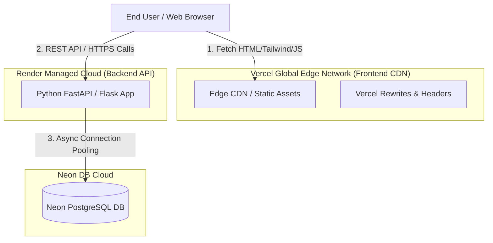

# Frontend Vercel Deployment Strategy (Deployment_vercel.md)

## 1. Executive Summary
This document specifies the deployment architecture, configuration, and CI/CD pipelines for hosting the frontend application on **Vercel**. By decoupling the frontend (Vercel global Edge Network) from the backend API (Render + Neon DB), the system achieves sub-50ms static asset delivery, instant preview deployments, and auto-scaling edge performance.

---

## 2. Decoupled Architecture Topology



---

## 3. Vercel Project Configuration (`vercel.json`)

Create a `vercel.json` file in the `frontend/` directory or root workspace to manage routing, headers, and SPA rewrites:

```json
{
  "version": 2,
  "name": "fullstack-prompt-engineering-frontend",
  "builds": [
    {
      "src": "frontend/index.html",
      "use": "@vercel/static"
    }
  ],
  "routes": [
    {
      "src": "/assets/(.*)",
      "headers": {
        "cache-control": "public, max-age=31536000, immutable"
      },
      "dest": "/frontend/assets/$1"
    },
    {
      "src": "/(.*)",
      "dest": "/frontend/index.html"
    }
  ],
  "headers": [
    {
      "source": "/(.*)",
      "headers": [
        {
          "key": "X-Content-Type-Options",
          "value": "nosniff"
        },
        {
          "key": "X-Frame-Options",
          "value": "DENY"
        },
        {
          "key": "X-XSS-Protection",
          "value": "1; mode=block"
        },
        {
          "key": "Referrer-Policy",
          "value": "strict-origin-when-cross-origin"
        }
      ]
    }
  ]
}
```

---

## 4. Vercel Environment Variables & API Binding

Set the following environment variables in the **Vercel Project Dashboard** (`Settings -> Environment Variables`):

| Variable Name | Environment | Example Value | Description |
| :--- | :--- | :--- | :--- |
| `API_BASE_URL` | Production & Preview | `https://your-api.onrender.com/api/v1` | URL of the backend API deployed on Render |
| `FIREBASE_API_KEY` | Production & Preview | `AIzaSyX...` | Public Firebase Web Auth API Key |
| `FIREBASE_AUTH_DOMAIN` | Production & Preview | `your-app.firebaseapp.com` | Firebase Auth Domain |
| `FIREBASE_PROJECT_ID` | Production & Preview | `your-app-id` | Firebase Project ID |

---

## 5. Automated CI/CD & Branch Previews

1. **GitHub Integration**: Connect your GitHub repository (`parthongit89/Project-Strategies-Prompt-engineering-`) to Vercel via Vercel GitHub App.
2. **Automatic Build Triggers**:
   - **Production Branch (`main`)**: Every commit merged into `main` automatically triggers a production deployment to `https://your-app.vercel.app`.
   - **Feature Branches**: Pushing to any feature branch generates a unique, isolated **Preview URL** (e.g. `https://your-app-git-feature-x.vercel.app`) for instant verification.
3. **Instant Rollbacks**: Instant 1-click rollback capability to any previous deployment state in the Vercel dashboard.

---

## 6. Backend CORS Synchronization (Render API)

To allow the Vercel frontend to communicate with the Render Python backend without CORS errors, update `CORS_ORIGINS` in your Render backend settings:

```ini
# Render Environment Variable
CORS_ORIGINS=https://your-app.vercel.app,https://*.vercel.app,http://localhost:3000
```
