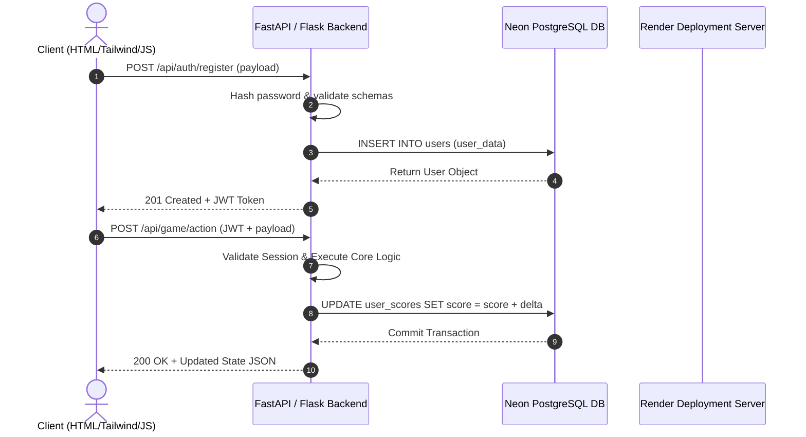

# Project Requirement Document (PRD.md)

## 1. Executive Summary & Vision
This document outlines the product requirements and core logic for building scalable, high-performance web applications using **Full Stack Prompt Engineering**. The system architecture leverages a Python backend (FastAPI / Flask), PostgreSQL database hosted on Neon DB, deployment via Render, and a responsive frontend powered by HTML5, Tailwind CSS, and JavaScript.

---

## 2. Target Audience & Core Use Cases
- **End Users**: Gamers, interactive web app users, or web tool consumers requiring real-time responsive interfaces and robust authentication.
- **Developers / Prompt Engineers**: Teams seeking structured AI-assisted development workflows with modular architecture and robust documentation.
- **System Administrators**: Automated CI/CD, managed Neon DB scaling, and seamless Render deployment management.

---

## 3. Key Feature Specifications

### 3.1 Authentication & User Management
- **User Registration**: Username, Email, Password hashing using Argon2 / bcrypt.
- **Login System**: Secure JWT-based token authentication (Access + Refresh tokens) or Session cookies.
- **Role-Based Access Control (RBAC)**: User, Admin, and Moderator levels.
- **Password Reset & Account Security**: Tokenized email resets and rate-limited endpoints.

### 3.2 Core Application & Game Logic Engine
- **State Management**: Real-time server-side validation of game states/transactions.
- **Interactive Rules**: Strict server-enforced game/business rules ensuring clients cannot cheat or bypass logic.
- **Leaderboards & History**: Asynchronous database writes to track user high scores, session logs, and statistics.
- **API Interfaces**: RESTful JSON API endpoints + WebSocket support for real-time multiplayer or push updates.

### 3.3 Frontend Experience
- **Responsive Layout**: Mobile-first design using Tailwind CSS.
- **Dynamic Interactions**: Vanilla JS or lightweight reactive state management.
- **Design Ingestion Modes**: Integration with Stitch AI Prompts, Figma + MCP Server, or manual UI implementation.

---

## 4. Core Building Logics & Data Flow

---

## 5. Non-Functional Requirements
- **Performance**: API response times under 150ms for core endpoints; sub-second database transactions on Neon DB.
- **Availability**: 99.9% uptime target hosted on Render's managed Web Services.
- **Scalability**: Stateless backend API nodes for horizontal auto-scaling.
- **Security**: Mandatory HTTPS, CORS configuration, parameterized queries, and strict input validation via Pydantic/Marshmallow.
