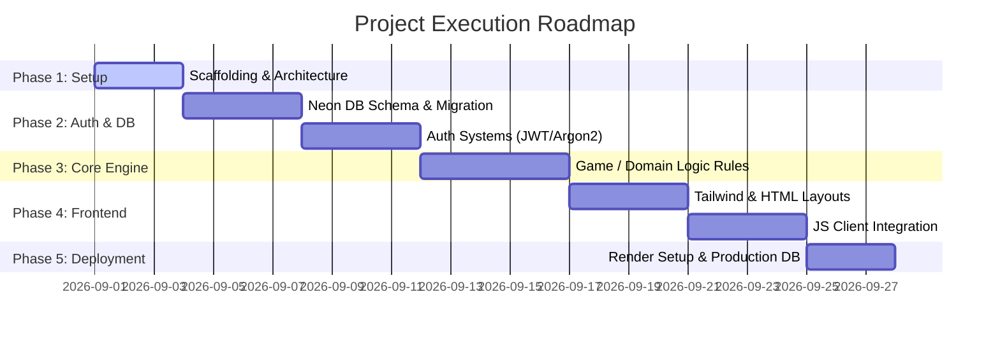

# Project Development Roadmap & Phases (Phases.md)

## Phase Overview

---

## Phase 1: Scaffolding & Environment Setup
- [ ] Initialize repository structure (`backend/`, `frontend/`, `docs/`).
- [ ] Create virtual environment and install base dependencies (`fastapi`, `uvicorn`, `sqlalchemy`, `pydantic-settings`, `alembic`).
- [ ] Configure `environment.env` and `.env.example`.
- [ ] Setup `README.md`, `.gitignore`, and Git repository tracking.

---

## Phase 2: Database Schema & User Authentication
- [ ] **Neon DB Setup**: Provision PostgreSQL database instance on Neon DB.
- [ ] **Data Modeling**:
  - `users` table: `id`, `email`, `username`, `hashed_password`, `role`, `created_at`.
  - `user_sessions` / `game_states` table: `id`, `user_id`, `state_data`, `score`, `updated_at`.
- [ ] **Alembic Migrations**: Generate initial migration script and verify upgrade capability.
- [ ] **Authentication Engine**:
  - Implement `/api/v1/auth/register` (input validation, duplicate email check, password hashing).
  - Implement `/api/v1/auth/login` (verify credentials, return JWT access token).
  - Implement `/api/v1/auth/me` (protected route returning current user profile).

---

## Phase 3: Core Domain & Game Logic Implementation
- [ ] **Business Rules Engine**:
  - Define state transition algorithms (server-authoritative execution).
  - Implement scoring, move validation, or action rules.
- [ ] **API Endpoints**:
  - `POST /api/v1/game/start`: Initializes session state.
  - `POST /api/v1/game/action`: Validates action payload, updates database state, returns updated UI data.
  - `GET /api/v1/game/leaderboard`: Returns top player rankings with caching.

---

## Phase 4: Frontend UI Integration & Styling
- [ ] **Base Design System**:
  - Configure Tailwind CSS via CDN or build pipeline.
  - Build responsive dark/light mode layout templates (`index.html`, `login.html`, `dashboard.html`).
- [ ] **Design Ingestion Workflow**:
  - Convert designs from Google Stitch AI prompts or Figma MCP into clean HTML/Tailwind templates.
- [ ] **JS API Client Integration**:
  - Implement `api_client.js` with `fetch` wrapper handling JWT headers, 401 token refresh, and error toasts.
  - Bind DOM events to auth and game action APIs.

---

## Phase 5: Production Deployment & Verification
- [ ] **Neon DB Production Configuration**:
  - Apply database migrations to Neon DB production database branch.
  - Enable SSL connection pooling.
- [ ] **Render Deployment**:
  - Create Web Service on Render linked to GitHub repository.
  - Configure Environment Variables (`DATABASE_URL`, `SECRET_KEY`, `CORS_ORIGINS`).
  - Deploy and test live build.
- [ ] **Final Verification**:
  - Execute end-to-end user journeys (Register -> Login -> Core Action -> Leaderboard view).
  - Run security and performance audits.
