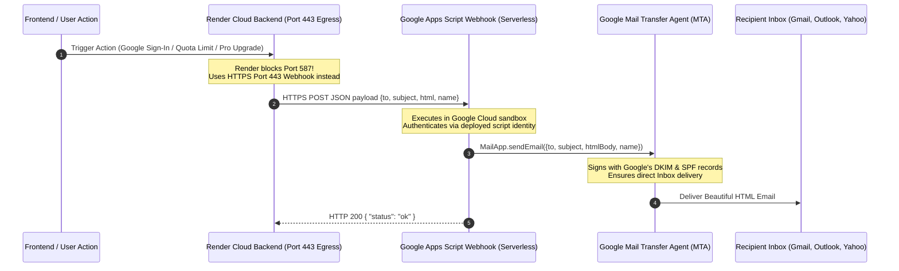

# Free Cloud Transactional Email Strategy: Google Apps Script HTTPS Webhook Engine (SMTP_free_cloud_email_strategy.md)

## 1. Executive Summary & The Cloud Port Blocking Problem

Modern cloud platforms—including **Render (Free Tier)**, **Vercel Serverless**, **AWS Lambda**, **Heroku**, **Fly.io**, and **Railway**—enforce strict egress network firewall policies. Specifically, they block outbound TCP traffic on traditional mail ports:
* **Port 25** (Standard SMTP - completely blocked industry-wide)
* **Port 465** (SMTPS - blocked on most serverless/free tiers)
* **Port 587** (SMTP with STARTTLS - blocked on Render free instances)

When a backend application attempts to send emails using standard libraries such as Python's `smtplib` or Node.js's `nodemailer` on Render free tier, the socket connection immediately times out or throws:
```bash
[Errno 101] Network is unreachable
# or
socket.timeout: timed out
```

This guide details the architectural design, setup runbook, and production integration for a **100% Free, Zero-Configuration, Cloud-Compatible Transactional Email Engine** powered by an **HTTPS Google Apps Script Webhook (Port 443)**.

---

## 2. Comparison Matrix: Traditional SMTP vs. Cloud Email Providers

| Feature / Metric | Traditional SMTP (`smtp.gmail.com:587`) | Resend Free Sandbox (`resend.dev`) | SendGrid / Mailgun Free | Google Apps Script Webhook (Port 443) |
| :--- | :--- | :--- | :--- | :--- |
| **Monetary Cost** | $0 | $0 | $0 | **$0 / ₹0 (100% Free)** |
| **Credit Card Required?** | No | No | Yes (Frequently required for anti-abuse) | **No (Zero financial risk)** |
| **Render Cloud Firewall** | ❌ **Blocked** (`Errno 101`) | ✅ Allowed (Port 443 HTTPS) | ✅ Allowed (Port 443 HTTPS) | ✅ **Allowed (Port 443 HTTPS)** |
| **Send to ANY Recipient?**| ✅ Yes | ❌ **No** (Only to account owner's email) | ✅ Yes | ✅ **Yes (Any recipient worldwide)** |
| **Custom Domain Required?**| No | ❌ **Yes** (Cannot verify `web.app`/`onrender.com` DNS) | ❌ **Yes** (Requires TXT/CNAME records) | **No (Works with any `@gmail.com`)** |
| **Custom Sender Name** | Supported | Supported | Supported | ✅ **Supported (`Snipy AI <email>` via `name` param)** |
| **Daily Quota** | 500 emails/day | 100 emails/day | 100 emails/day | **100 / day (Personal) • 1,500 / day (Workspace)** |
| **Inbox Deliverability** | Good | Moderate (Shared sandbox domain) | Variable | **High (Direct Google MTA with SPF/DKIM)** |

---

## 3. High-Level Architecture: HTTPS Relay over Port 443

Rather than opening an ephemeral raw TCP socket over blocked port 587, the backend application makes an encrypted standard **HTTPS POST request (Port 443)** to a serverless Google Apps Script Webhook. Google's internal cloud fabric accepts the payload and triggers `MailApp.sendEmail()`, which routes the email directly through Google's authentic Gmail Mail Transfer Agents (MTAs).



---

## 4. Google Apps Script Webhook Setup Runbook

### Step 1: Mitigating Multi-Account Cookie Conflicts
When a developer is logged into multiple Google accounts in one browser (e.g. personal and project accounts), navigating to `script.google.com` often results in the following Google Drive error:
> *"Google Drive — Sorry, unable to open the file at present. Please check the address and try again."*

**The Fix (Bypass Solutions):**
1. **Option A (Recommended):** Open an **Incognito / Private Window** (`Ctrl + Shift + N`), log in *only* to the intended sender Google account, and navigate to [script.google.com/home/start](https://script.google.com/home/start).
2. **Option B (Google Sheets Bridge):** Open [sheets.new](https://sheets.new) while logged into the desired account, click **Extensions** $\rightarrow$ **Apps Script**. This creates a bound project that completely bypasses the Drive multi-session routing bug.

---

### Step 2: Webhook Implementation Code (`Code.gs`)
Replace the default script contents with the following robust JSON request handler:

```javascript
/**
 * Snipy AI - Serverless Transactional Email Relay
 * Accepts JSON POST payload and dispatches emails via Google MailApp.
 */
function doPost(e) {
  try {
    var data = JSON.parse(e.postData.contents);
    
    // Validate required fields
    if (!data.to || !data.subject || !data.html) {
      return ContentService.createTextOutput(JSON.stringify({
        status: "error",
        message: "Missing required fields: to, subject, or html"
      })).setMimeType(ContentService.MimeType.JSON);
    }
    
    // Dispatch email through official Google Mail infrastructure
    MailApp.sendEmail({
      to: data.to,
      subject: data.subject,
      htmlBody: data.html,
      name: data.name || "Snipy AI"  // Branded sender display name
    });
    
    return ContentService.createTextOutput(JSON.stringify({
      status: "ok",
      recipient: data.to,
      timestamp: new Date().toISOString()
    })).setMimeType(ContentService.MimeType.JSON);
    
  } catch (err) {
    return ContentService.createTextOutput(JSON.stringify({
      status: "error",
      message: err.toString()
    })).setMimeType(ContentService.MimeType.JSON);
  }
}
```

---

### Step 3: Deployment as a Public Web App
To allow the cloud backend (Render) to reach the script without complex OAuth token refreshing:

1. Click **Deploy** (top-right button) $\rightarrow$ **New deployment**.
2. Click the **Gear icon (⚙️)** next to "Select type" and choose **Web app**.
3. Configure the deployment parameters:
   * **Description**: `Snipy AI Transactional Email Relay v1`
   * **Execute as**: `Me (<your-email>@gmail.com)`
   * **Who has access**: ⚠️ **`Anyone`** *(Crucial: Allows unauthenticated backend POST requests)*.
4. Click **Deploy**.

---

### Step 4: Authorizing OAuth Permissions
Google requires one-time permission for the script to send emails on your behalf:
1. Click **Authorize access**.
2. Select your Google account.
3. You will see: *"Google hasn't verified this app"*.
4. Click **Advanced** (bottom left of modal) $\rightarrow$ Click **"Go to Untitled project (unsafe)"**.
5. Review permissions (*"Send email on your behalf"*) and click **Allow**.

---

### Step 5: Webhook URL Extraction
Copy the generated **Web App URL**, which follows this format:
```
https://script.google.com/macros/s/AKfycb..._6Cq48cglZ3d/exec
```

---

## 5. Backend Integration Architecture (Python & FastAPI/Flask)

### Resilient Asynchronous Worker (`email_service.py`)
To prevent email network latency from blocking API response times, email dispatch must execute asynchronously in a background thread or task runner:

```python
import os
import logging
import threading
import requests

logger = logging.getLogger("snipy.email")

GOOGLE_APPS_SCRIPT_URL = os.getenv("GOOGLE_APPS_SCRIPT_URL", "")

def _async_post_worker(to_email: str, subject: str, html_content: str, sender_name: str = "Snipy AI"):
    """Background worker sending email payload via HTTPS Port 443."""
    if not GOOGLE_APPS_SCRIPT_URL:
        logger.warning("GOOGLE_APPS_SCRIPT_URL not configured. Skipping email dispatch.")
        return

    payload = {
        "to": to_email,
        "subject": subject,
        "html": html_content,
        "name": sender_name
    }

    try:
        response = requests.post(
            GOOGLE_APPS_SCRIPT_URL,
            json=payload,
            timeout=18  # Google Apps Script typically completes in 1.5 - 3 seconds
        )
        if response.status_code == 200:
            logger.info(f"Email successfully delivered to {to_email}")
        else:
            logger.error(f"Apps Script responded with HTTP {response.status_code}: {response.text}")
    except Exception as exc:
        logger.error(f"Failed to deliver email to {to_email}: {exc}")

def send_transactional_email(to_email: str, subject: str, html_content: str):
    """Public non-blocking interface."""
    threading.Thread(
        target=_async_post_worker,
        args=(to_email, subject, html_content),
        daemon=True
    ).start()
```

---

## 6. HTML Template Design & Personalization Engine

Modern transactional emails require clean typography, mobile responsiveness, dark-mode styling, and brand consistency.

### Template Specifications:
1. **Typography**: Google Sans Flex / System UI stack (`'Google Sans Flex', -apple-system, BlinkMacSystemFont, 'Segoe UI', Roboto, sans-serif`).
2. **Branded Visuals**: Render real isometric 3D cube icons hosted on a reliable CDN (`https://snipy-ai.web.app/icons/cube-icon.png`).
3. **Dynamic Greeting Injection**: Extract user names from Google OAuth tokens and dynamically replace table greeting slots (`Hi {user_name},`).
4. **Sanitization**: Strip JavaScript `<script>` tags, which trigger spam filters in email clients like Outlook, Apple Mail, and Gmail.

```python
import re

def render_welcome_email(user_name: str = "Developer") -> str:
    template_path = "email_temp/email_template.html"
    with open(template_path, "r", encoding="utf-8") as f:
        html = f.read()

    # Strip script tags for email client safety
    html = re.sub(r'<script.*?</script>', '', html, flags=re.DOTALL | re.IGNORECASE)

    # Inject dynamic user greeting
    greeting = f"Hi {user_name},"
    html = html.replace("&nbsp;</td></tr><tr><td dir=\"ltr\"", f"{greeting}</td></tr><tr><td dir=\"ltr\"")
    return html
```

---

## 7. Supported Transactional Email Triggers

In the Snipy AI full-stack architecture, the email engine powers 4 mission-critical lifecycle events:

1. **User Welcome & Onboarding**:
   * *Trigger*: User completes Google OAuth sign-in via Firebase.
   * *Purpose*: Delivers platform intro, initial quota status (10 Tokens / 30 Problems), and telemetry dashboard link.
2. **AI Quota Exhaustion Alert**:
   * *Trigger*: User attempts code optimization after consuming free daily token limit.
   * *Purpose*: Informs the user of Bedrock cost protection limits and provides an upgrade CTA.
3. **Pro Tier Subscription / Upgrade Receipt**:
   * *Trigger*: Successful Razorpay / Stripe payment event.
   * *Purpose*: Confirms unlimited optimization unlocks and issues a transaction reference.
4. **Weekly Telemetry Digest**:
   * *Trigger*: Automated cron job every Monday morning.
   * *Purpose*: Summarizes lines of code reduced, anti-patterns eliminated, and most active IDEs.

---

## 8. Security & Operational Guardrails

1. **Endpoint Obfuscation**: The Google Apps Script URL contains a cryptographically secure deployment hash that is difficult to enumerate.
2. **Rate Limiting**: Free Gmail accounts are capped at **100 emails/day** by Google. If your app surges beyond 100 emails, Google returns a quota exceeded error without billing or suspending the Google account.
3. **Spam Deliverability**: Because the email originates from Google's authenticated IP pools with valid Gmail SPF and DKIM signatures, transactional emails reliably hit the **Primary Inbox** rather than the Spam or Promotions folder.
