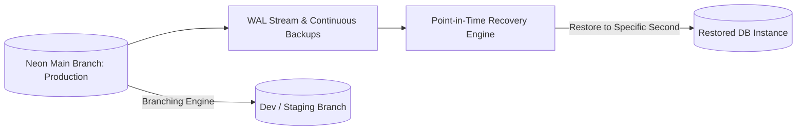

# Database Security & Data Protection Strategy (Security_db.md)

## 1. Executive Summary
This document establishes the database security, encryption standards, connection management, and accidental data loss prevention protocols for **PostgreSQL running on Neon DB**.

---

## 2. Neon DB Encryption & Connection Security

### 2.1 Encryption Standards
- **Encryption in Transit**: All connection traffic between FastAPI/Render and Neon DB MUST be encrypted via **TLS 1.3** using `sslmode=require` or `sslmode=verify-full`.
- **Encryption at Rest**: Neon DB automatically encrypts all underlying storage blocks, WAL (Write-Ahead Logs), and automated backups using AES-256 bits keys managed by cloud KMS.

### 2.2 Connection String Security
- Direct primary database credentials must NEVER be exposed in frontend clients or public repositories.
- Use Neon's pooled endpoint (`ep-xxx-pooler.neon.tech`) to prevent connection pool exhaustion in serverless or multi-worker deployment environments:

```ini
# Production Environment Variable (Stored securely in Render dashboard)
DATABASE_URL=postgresql://<user>:<password>@ep-example-pooler.us-east-2.aws.neon.tech/neondb?sslmode=require
```

---

## 3. Data Loss Prevention (DLP) & Disaster Recovery



### 3.1 Protection Against Accidental Data Loss
1. **Neon Instant Database Branching**:
   - Never run raw SQL migrations or schema experiments directly on the production branch (`main`).
   - Create a instant child branch in Neon (`git-like branching`): `neon branch create schema-migration-v2`.
   - Test migrations against the branch; verify zero data corruption; merge/apply to `main`.
2. **Point-in-Time Recovery (PITR)**:
   - Neon maintains continuous Write-Ahead Log (WAL) archiving.
   - If an accidental `DROP TABLE` or corrupting bulk update occurs, perform a instant point-in-time recovery to any specified timestamp within the retention window (e.g. 5 minutes prior to incident).
3. **Database Role Privileges (Least Privilege Principle)**:
   - The application database user should NOT possess `SUPERUSER` permissions.
   - Application user permissions are restricted to `SELECT`, `INSERT`, `UPDATE`, `DELETE` on designated schemas.
   - Schema alterations (`ALTER TABLE`, `DROP TABLE`) must be executed solely via dedicated migration roles during deployment pipelines.

---

## 4. Database Audit Logging & Sanity Protocol

### 4.1 SQL Injection Prevention Protocol
```python
# GOOD: SQLAlchemy ORM parameterized query (Safe against SQL Injection)
stmt = select(User).where(User.email == user_email)
result = await session.execute(stmt)

# BAD: String interpolation / raw string formatting (DO NOT USE)
# query = f"SELECT * FROM users WHERE email = '{user_email}'"
```

### 4.2 Database Health Checks & Sanitization
- Configure database connection health pings in FastAPI:
```python
engine = create_async_engine(
    settings.DATABASE_URL,
    pool_pre_ping=True,      # Automatically recycles stale or dropped connections
    pool_size=10,
    max_overflow=20,
)
```
- Schedule periodic verification of foreign key integrity and table bloat using `VACUUM ANALYZE`.
